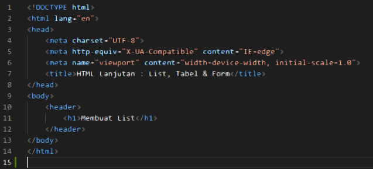
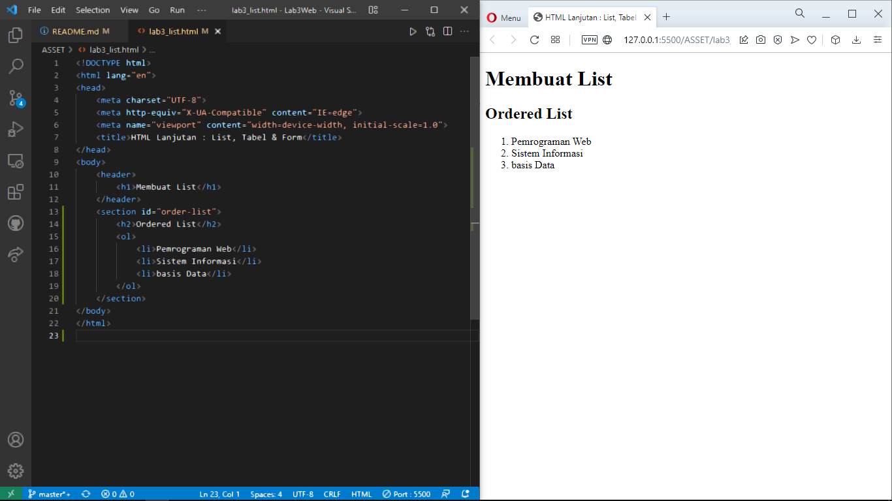
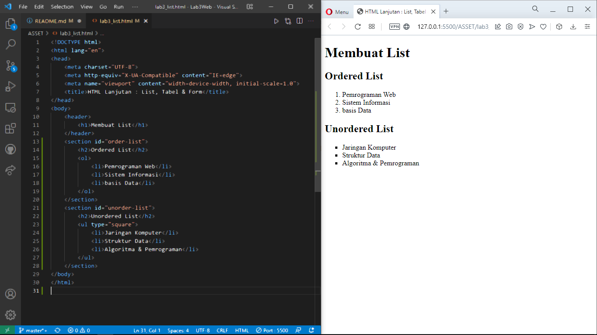
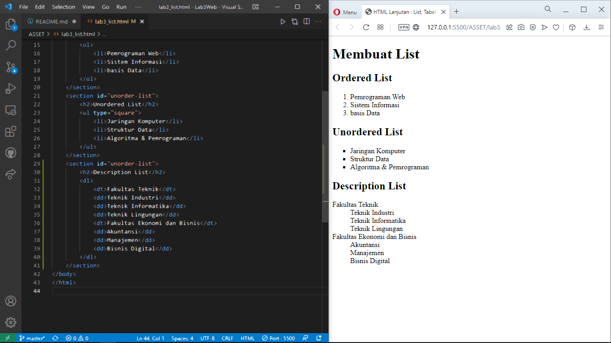
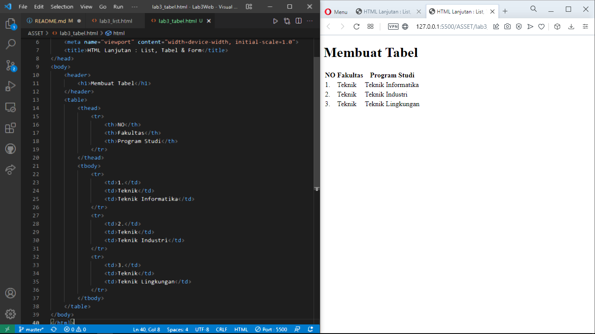
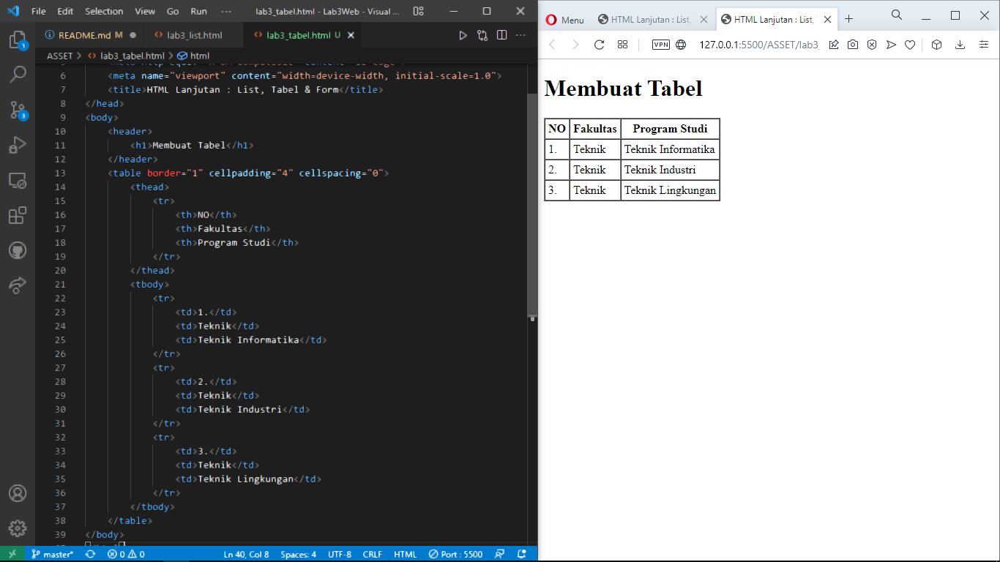
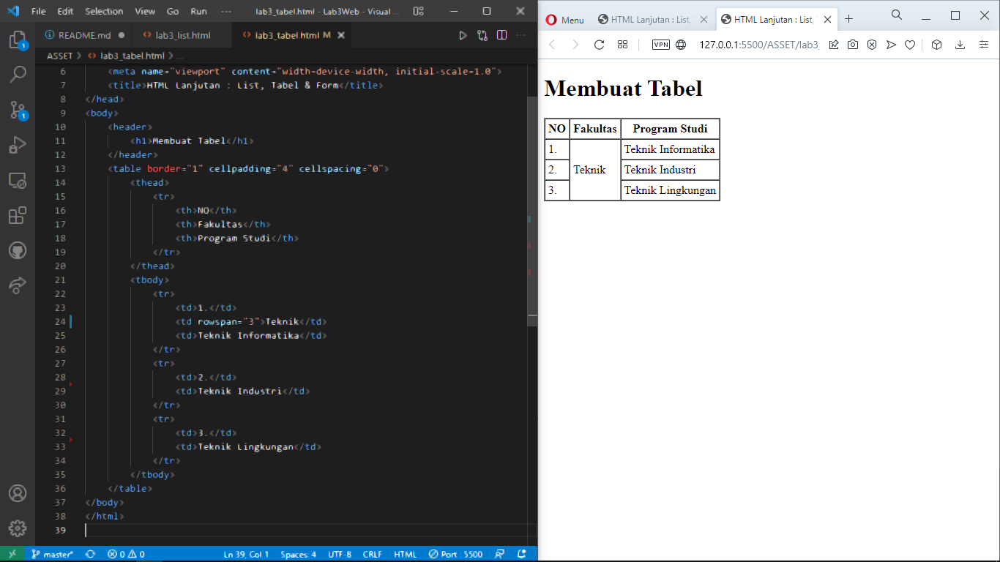
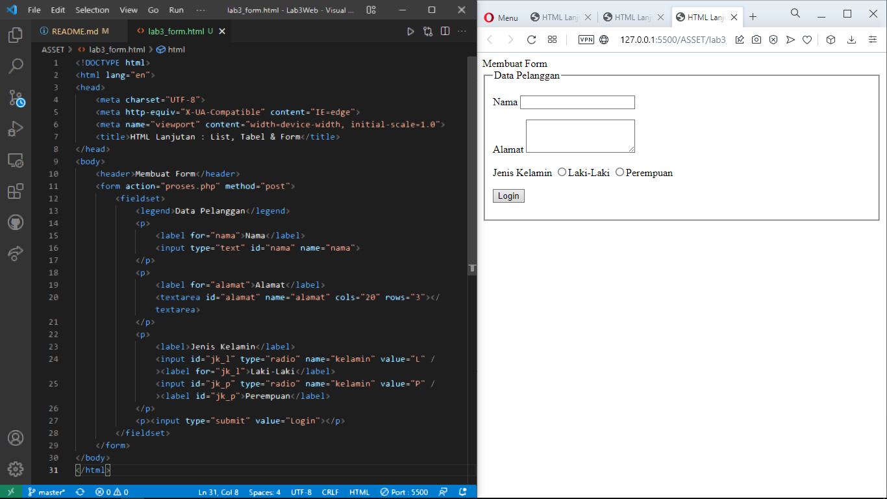
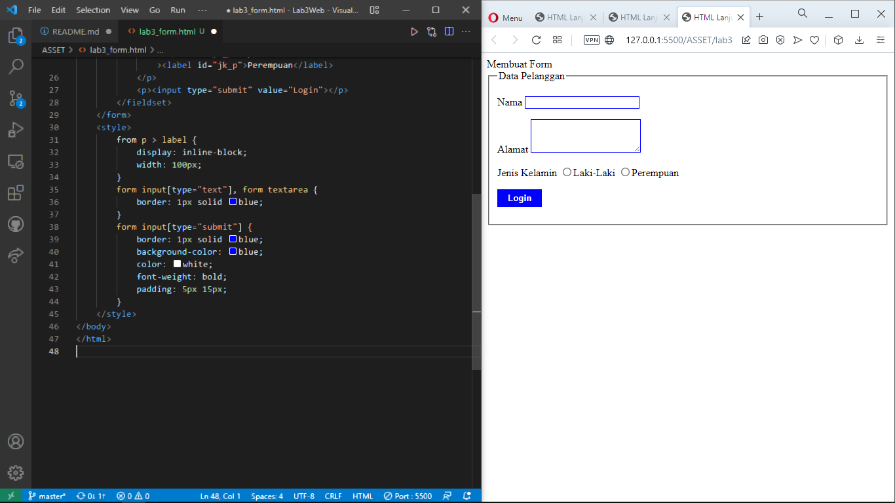

| Nama  | Oktovan Agung Shailendra|
|-------|-------------------------|
|NIM    |312010131                |
| Kelas | TI.20.A.1               |

---

# Langkah - Langkah Praktikum

Persiapan membuat dokumen HTML dengan nama file **lab3_list.html** seperti berikut.

## Membuat Ordered List
Kemudian tambahkan kode untukmembuat *Ordered List* seperti berikut. kemudian simpan dan refresh halaman webuntuk melihat hasilnya.

## Membuat Unordered list
Kemudian Tambahkan kode untuk membuat *Unordered list*, setelahnya deklarasikan ordered list pada section `unordered-list`, seperti berikut.

## Membuat Description List
Kemudian tabahkan kode untuk membuat description list setelah deklarasi unordered-list.

Selanjutnya lakukan eksperimen lain terkait list dan penggunaan atribut type pada list.

## Membuat Tabel
Buat file baru dengan nama **lab3_tabel.html**. Kemudian tambahkan kode untuk membuat tabel sederhana seperti berikut.

## Mengatur Margin dan Padding
Untuk mengatur margin dan padding pada cell data, tambahkan atribut `cellpadding` dan `cellspacing`

## Menggabungkan Sel Data
Untuk menggabungkan sel data, gunakan atribut `rowspan` dan `colspan`. Atribut `rowspan` untuk menggabungkan baris (vertikal) dan `colspan` untuk menggabungkan kolom (horizontal).

## Membuat Form
Buat file baru dengan nama **lab3_form.html**. Kemudian tambahkan kode untukmembuat tabel sederhana sepertiberikut.

## Menambahkan Style Pada Form
Agar tampilan form lebih menarik, bisa ditambahkan CSS seperti berikut.

# Pertanyaan & Tugas

## 1 Buatlah form yang menampilkan *dropdown* menu dan *listbox* dengan *multiple section*
